# Linux-Native BTC Perpetual Target Architecture

Status: accepted; implemented incrementally under phase acceptance gates
Target venue: Hyperliquid
Target instrument: `BTC-USD-PERP.HYPERLIQUID`
Legacy runtime: MT5/XAUUSD remains operational until separately approved Phase 10 retirement

## Objectives

The target is a Linux-native quantitative trading platform for continuous BTC
perpetual market making and short-horizon scalping. It must collect exchange
events, generate causal microstructure features, execute through a synchronous
risk authority, reproduce strategy decisions in research, and preserve a human
approval boundary before production promotion.

The migration is a replacement, not an MQL-to-Python translation. The current
MT5 runtime is isolated and frozen while the native system is built and
validated alongside it.

## Scope and explicit assumptions

- `BTCUSD` means Hyperliquid's standard USDC-margined BTC perpetual, represented
  by NautilusTrader as `BTC-USD-PERP.HYPERLIQUID`; it does not mean spot.
- Version one supports one venue and one instrument. Multi-venue routing,
  portfolio netting, options, spot, and additional perpetuals require new ADRs.
- Python 3.12 is the application language. NautilusTrader supplies a Rust core;
  custom Rust is introduced only after profiling identifies a material hot spot.
- Testnet, paper, and shadow validation precede mainnet.
- Mainnet capital and numeric risk limits are deployment inputs. Missing,
  expired, or unapproved values make the trading node fail closed.
- Automated research and retraining produce challengers. Automation cannot
  approve a challenger for production or increase production capital.
- Profitability is an empirical promotion requirement, not an architectural
  promise.

## System context

The rendered source is
[`diagrams/system-context.mmd`](diagrams/system-context.mmd).

```mermaid
flowchart LR
    HL[Hyperliquid REST and WebSocket]
    TD[Tardis historical data]

    HL --> REC[Market-data recorder]
    REC --> RAW[Immutable raw archive]
    RAW --> NORM[Validated Parquet datasets]
    TD --> NORM

    HL --> NT[Nautilus trading node]
    NT --> FE[Incremental feature engine]
    FE --> ST[Market maker / Scalper / ML]
    ST --> RK[Synchronous risk authority]
    RK --> EX[Nautilus execution adapter]
    EX --> HL

    EX --> EJ[Execution journal]
    EJ --> ANA[DuckDB analytics]
    NORM --> RES[Research workers]
    RES --> GOV[Champion-challenger registry]
    GOV --> AP[Human approval boundary]
    AP --> NT

    SENT[Independent safety sentinel] --> HL
    NT --> PROM[Prometheus]
    REC --> PROM
    SENT --> PROM
    PROM --> OBS[Grafana and Alertmanager]
```



## Service boundaries

### Trading node

A single NautilusTrader event loop owns the live market book, incremental
features, strategy instances, risk state, order lifecycle, positions, and
execution reconciliation. The decision path remains in-process. It must not
depend on DuckDB, Parquet, Prometheus, Grafana, or a remote message broker to
accept, reject, cancel, or flatten an order.

The live order flow is documented in
[`diagrams/live-order-flow.mmd`](diagrams/live-order-flow.mmd).

### Market-data recorder

The recorder owns an independent public connection so research capture is not
coupled to the health or subscription choices of the trading node. It records
each received frame before normalization, performs integrity checks, and emits
hourly immutable partitions and manifests.

### Safety sentinel

The sentinel uses the official Hyperliquid SDK and a control-specific API
wallet. It renews the exchange dead-man switch, observes the trading-node
heartbeat from outside that process, cancels resting orders after a confirmed
failure, and exposes an authenticated operator kill action. It never places
ordinary strategy orders.

The trading node and sentinel use different API wallets. This prevents shared
signer nonce contention and separates routine execution authority from emergency
control authority.

### Research worker

Research workers import licensed Tardis files and local raw captures, construct
causal datasets, run HftBacktest and NautilusTrader validation, train model
challengers, and generate immutable reports. They cannot access a production
trading private key.

### Governance service and CLI

Governance owns experiment identities, dataset and artifact hashes, validation
stages, approval records, deployment manifests, champion history, and rollback
targets. The service may advance a candidate only as far as
`AWAITING_APPROVAL` without a signed human decision.

### Observability stack

Prometheus scrapes bounded-cardinality metrics. Grafana visualizes operations,
risk, execution quality, PnL attribution, and drift. Alertmanager routes
state-transition alerts. Order IDs, trade IDs, and client order IDs are fields
in structured logs, not metric labels.

## Market-data architecture

### Sources

The live system consumes:

- L2 book snapshots and BBO;
- public trades and aggressor information;
- mark and index prices;
- funding state and funding payments;
- open interest and asset context;
- instrument metadata and trading status;
- private order, fill, position, funding, liquidation, and ADL events.

Hyperliquid's public L2 channel is market-by-price and publishes full snapshots;
it is not an order-by-order feed. Tick-level storage therefore means every
published exchange event. Actual queue position is not observable and must
never be represented as ground truth.

Market-wide liquidation events are not available in the documented public
Hyperliquid/Tardis channel set. Version one records the account's private
liquidation/ADL events and publishes a capability flag declaring market-wide
liquidation data unavailable. ADR 0007 defines this boundary.

### Raw archive

Each hourly raw segment is an append-only Zstandard-compressed record stream.
Every envelope contains:

- receive time in UTC nanoseconds;
- local monotonic time;
- connection and subscription identifiers;
- channel and instrument;
- exact payload bytes encoded without JSON reserialization;
- a SHA-256 payload digest;
- recorder build and schema versions.

Segments are written to a temporary name, fsynced, atomically renamed, and
registered in a manifest containing record count, byte count, time range, and
segment digest. A crashed partial segment is quarantined and never silently
included in a research dataset.

### Normalized storage

Validated events are written to Parquet, partitioned by
`venue/channel/instrument/date/hour`. A Nautilus-compatible catalog is produced
from the same normalized records. DuckDB stores partition manifests,
experiments, deployments, and analytical views, but is not used in the trading
hot path. Each writable DuckDB database has a single owning process.

### Integrity policy

The feed does not expose a sequence/checksum contract sufficient to prove that
no exchange event was missed. Integrity reporting is therefore explicit rather
than optimistic. It records reconnect intervals, message silence, duplicate
trade keys, crossed or invalid books, timestamp regressions, schema failures,
and publication cadence anomalies. Research windows crossing an unexplained or
policy-exceeding gap are rejected.

## Feature engine

All live features are incremental, causal, timestamped, versioned, and bounded
in memory. Feature snapshots carry source-event time, receive time, computation
time, and maximum input age.

Feature families are:

- order book: imbalance by level and basis-point band, microprice, VAMP,
  weighted midprice, depth imbalance, and public queue/depth imbalance;
- flow: trade-flow imbalance, aggressor ratio, volume delta, buy/sell pressure,
  and short-horizon signed volume;
- volatility: realized volatility, ATR, spread dynamics, jump measures, and
  volatility regime;
- inventory: confirmed inventory, target drift, liquidation distance, margin
  use, and inventory-at-risk;
- microstructure: spread, book age, fill probability, quote lifetime,
  cancel-to-fill ratio, and adverse-selection markouts.

Fill probability and queue estimates are calibrated from the platform's own
order lifecycle. They are model estimates with confidence and version metadata.

## Strategy engine

### Avellaneda-Stoikov market maker

The market maker uses a rolling horizon, empirical arrival intensity, realized
volatility, inventory target, funding, and adverse-selection state. It emits
post-only quotes with dynamic reservation price and spread. Quote coalescing,
minimum quote lifetime, price hysteresis, and order-rate budgets prevent cancel
storms.

### Order-flow scalper

The scalper combines order-book imbalance, signed trade flow, short-horizon
momentum, spread state, and volatility regime. It may submit a taker or passive
entry only when expected post-fee edge exceeds modeled slippage and a configured
safety margin. Exits can be reduce-only.

### Machine-learning forecasts

Separate tabular models estimate next-mid movement, passive fill probability,
spread expansion, and volatility regime. LightGBM is the initial reference;
XGBoost and CatBoost are challengers. Deep learning is out of scope until the
tabular baseline and data volume justify it. Artifacts use safe model-native
formats plus an exact feature schema and never rely on arbitrary pickle loading.

Strategies share pure decision and quoting kernels between research and live
execution. Adapters translate those decisions into simulator or Nautilus order
commands.

## Risk authority

Risk evaluates every proposed order synchronously and can independently cancel
or flatten. Its state machine is:

```text
ACTIVE -> REDUCE_ONLY -> CANCEL_ONLY/HALTED -> FLATTENING
```

The most restrictive applicable state wins. Inputs include:

- UTC trading-day loss and rolling/high-water drawdown;
- realized and unrealized PnL, fees, rebates, and funding;
- position, inventory, leverage, available margin, and liquidation distance;
- maximum order size, open orders, notional, order rate, and cancel rate;
- market-data age, private-stream age, reconnect and reconciliation state;
- submit/ack latency, rejection rate, adverse selection, and model drift;
- persistent operator and deployment kill switches.

Limits exist in signed deployment policy and are clamped by immutable application
hard bounds. Missing or stale account state rejects exposure-increasing orders.
Cancel and reduce-only actions remain possible whenever the exchange connection
permits them.

The exchange dead-man switch is defense in depth: it can remove resting orders
when the process or network dies, but cannot flatten existing inventory. Mainnet
requires the external sentinel or an explicitly accepted residual-inventory
risk.

## Backtesting and validation

HftBacktest is used for market-by-price replay, probabilistic queue models,
latency injection, fees, funding, partial fills, and pessimistic execution
scenarios. Because the public feed cannot reveal real queue position, promotion
requires results across multiple calibrated and deliberately adverse queue and
latency models.

NautilusTrader backtest and sandbox modes validate the production strategy,
events, portfolio, risk, and order lifecycle. A candidate cannot advance if the
shared decision kernel disagrees between HftBacktest replay and Nautilus replay
beyond an explicitly versioned tolerance.

Validation includes purged walk-forward folds, embargo, untouched final
out-of-sample data, cost and latency stress, deterministic reruns, dataset
lineage, and negative controls. Tardis local capture latency is not treated as
Singapore production latency; live order-lifecycle measurements calibrate the
deployment latency model.

## Champion-challenger governance

The stage flow is rendered in
[`diagrams/research-promotion-flow.mmd`](diagrams/research-promotion-flow.mmd).

```text
DRAFT -> CANDIDATE -> BACKTEST_PASSED -> WALK_FORWARD_PASSED
      -> PAPER_PASSED -> SHADOW_PASSED -> AWAITING_APPROVAL
      -> APPROVED_CANARY -> PRODUCTION -> RETIRED
```

Any stage can transition to `REJECTED`; canary and production can transition to
`ROLLED_BACK`. Automation stops at `AWAITING_APPROVAL`. An approval records the
code, container, dataset, configuration, feature schema, and model hashes;
approver; expiry; capital ceiling; risk policy; and rollback target. Increasing
capital after canary requires a separate approval.

Production authority is renewed only through a short-lived detached Ed25519
approval chained to the current durable authorization. Renewal preserves the
deployment/admission, account/vault, artifacts, image, configuration, and
capital exactly; it cannot revive an expired admission or carry a champion,
risk, or capital change. This keeps weekly human review while allowing the same
production admission to accumulate the continuous Phase 10 observation.

Phase 10 reconstructs that observation offline from the signed release,
checkpointed schema-v2 ledger, every detached renewal, exact deployed artifact,
hash-linked execution/sentinel audits, reviewed incident register, and frozen
drill reports. The assembler requires the signer key ID and fingerprint from an
independent trust record and enforces five-minute sentinel/dead-man continuity.
It has no live venue, credential, signer, process, or cleanup capability. See
[`diagrams/phase-10-production-evidence.mmd`](diagrams/phase-10-production-evidence.mmd).

The final legacy archive is independently reconstructed from exactly eleven
category artifacts plus reviewed restore, recursive credential-scan, and
annotated `mt5-final` controls. The scan policy is pinned by the same frozen
retirement policy, and the schema-v2 output binds complete bundle provenance
and remaining retention. Archive verification has no broker, Git mutation,
process, credential, stop, or deletion capability. See
[`diagrams/phase-10-legacy-archive.mmd`](diagrams/phase-10-legacy-archive.mmd).

Promotion gates are frozen before an experiment begins and evaluate post-cost
PnL, drawdown and tail loss, consistency, inventory exposure, fill calibration,
maker ratio, markouts, latency, operational failures, and drift. Prediction
accuracy alone cannot pass a candidate.

## Deployment and security

The initial production topology uses Docker Compose on Debian Linux with Python
3.12 and a glibc version supported by the pinned NautilusTrader release. Images
and Python/Rust dependencies are pinned and locked. Containers run non-root with
read-only roots, explicit writable volumes, resource limits, health checks, and
JSON logs. Secrets are mounted at runtime and are never stored in images,
configuration files, logs, experiment records, or model artifacts.

Host time synchronization is monitored because event ordering and latency
measurements depend on it. Production and research credentials are distinct.
The trading wallet, control wallet, and read-only data credentials have the
minimum permissions required for their services.

During the parallel migration, native Python is isolated under
`native/src/aiquanttrader_native` so its dependency graph cannot alter the
deployed MT5 package. The final `src/aiquanttrader` topology shown in this
document is established only during the Phase 10 legacy-removal cutover. ADR 0008
records this temporary package boundary and its removal condition.

## Performance policy

The initial book cadence and one-instrument scope do not justify a custom Rust
trading stack. Performance work follows measurement:

1. publish latency histograms for receive-to-feature, feature-to-decision,
   decision-to-submit, and submit-to-ack;
2. profile CPU allocation and event-loop stalls under recorded burst replay;
3. optimize allocations and vectorized/offline operations in Python;
4. move a stable, benchmarked feature kernel or data converter to the Rust
   workspace only when it misses a ratified service-level objective.

## Authoritative external constraints

- [NautilusTrader Hyperliquid integration](https://nautilustrader.io/docs/latest/integrations/hyperliquid/)
- [NautilusTrader installation support](https://nautilustrader.io/docs/latest/getting_started/installation/)
- [Hyperliquid WebSocket subscriptions](https://hyperliquid.gitbook.io/hyperliquid-docs/for-developers/api/websocket/subscriptions)
- [Hyperliquid rate limits](https://hyperliquid.gitbook.io/hyperliquid-docs/for-developers/api/rate-limits-and-user-limits)
- [Hyperliquid nonces and API wallets](https://hyperliquid.gitbook.io/hyperliquid-docs/for-developers/api/nonces-and-api-wallets)
- [HftBacktest fill models](https://hftbacktest.readthedocs.io/en/py-v2.1.0/order_fill.html)
- [Tardis Hyperliquid coverage](https://docs.tardis.dev/historical-data-details/hyperliquid)
