# Scalper v2 Overhaul

## Decision

`smart-money-scalper-v2` replaces the failed v1 paper challenger. It is a
credential-free paper/replay challenger only. The live-strategy configuration
does not accept v2, and research cannot promote it into production without the
existing shadow, review, signature, canary, and admission gates.

The retained v1 paper journal was conclusive: 5,085 completed round trips had
a 1.75% net win rate, net PnL of -$325.54 after $288.14 of fees, and a net
profit factor of 0.014. Every observed UTC day was negative. The main defect
was economic rather than directional: frequent taker entry and exit paid more
than the captured move. V1 remains immutable evidence and must not be compared
with v2 by merging their run identities.

No design can guarantee a target number of profitable trades per day. V2
instead caps attempts at 48 per UTC day and trades only when its expected move
clears explicit costs. A quiet or statistically hostile market should produce
zero trades.

## Runtime design

```mermaid
flowchart LR
    WS[Hyperliquid BBO / L2 / trades / context] --> RAW[Raw archive]
    RAW --> FRESH[1.5 s BBO gate + independent L2 age]
    FRESH --> FE[Bounded 1 Hz incremental microstructure]
    FE --> MTF[Closed 15m / 5m / 1m structure]
    FE --> OF[1 Hz causal forecast sample]
    OF --> LABEL[Delayed 30 s label]
    LABEL --> SGD[Bounded online Huber update]
    SGD --> GATE[Accuracy and MAE gates]
    MTF --> ENTRY[SMC entry gate]
    GATE --> ENTRY
    ENTRY --> COST[Maker + taker + slippage + safety hurdle]
    COST --> RISK[Synchronous risk authority]
    RISK --> PAPER[Post-only paper entry]
    PAPER --> EXIT[Market risk exit within 180 s]
    PAPER --> JOURNAL[Checkpointed explicit memory]
```

An entry requires all of the following:

1. Closed 15-minute direction and closed 5-minute direction agree.
2. The latest closed 1-minute structure supplies BOS, CHoCH, or a liquidity
   sweep in that direction.
3. SMC confluence, book imbalance, trade-flow imbalance, and microprice agree.
4. Spread and volatility are within their configured limits.
5. The causal model has at least 500 resolved 30-second labels, at least 54%
   recent directional accuracy, and at most 12 bps recent MAE.
6. Forecast edge clears maker entry fee, taker exit fee, modeled slippage,
   safety margin, and required net edge.
7. The operator kill switch and the independent risk authority approve.

Entries rest post-only at the same-side best price for at most three seconds.
An unfilled entry is canceled rather than crossed. Risk exits remain reduce-only
market orders. Stops, profit protection, opposite structure/flow, and a hard
180-second holding limit bound exposure.

## Learning boundary

The learner is deliberately small: a regularized linear model over book,
queue, depth, trade-flow, momentum, microprice, and VAMP inputs. It samples at
1 Hz and only trains once the future 30-second midprice is observable. Huber
loss, decaying learning rate, clipped predictions, a bounded diagnostic window,
and a checkpoint-safe pending-label buffer limit outlier and memory risk.

Why this design:

- It is causal, cheap enough for every event loop, explainable, deterministic,
  and fully checkpointable.
- A continuously refit boosted tree was rejected for the hot loop because it
  adds training spikes, artifact ambiguity, and harder restart equivalence.
- Deep learning was rejected because current evidence volume does not justify
  its operational and overfitting risk.
- A fixed hand-written score was rejected because v1 showed that confluence
  alone did not establish post-cost expectancy.
- An LLM decision gate was rejected because latency, nondeterminism, and prompt
  drift make it unsuitable for sub-five-minute order authority. The existing
  optional LLM observer remains asynchronous, shadow-only, and disabled.

The model may adapt paper decisions, but it cannot change risk limits, deploy
code, sign promotion, or select itself as production champion. Offline research
may nominate a frozen model/config artifact only after purged walk-forward and
cost-stress evaluation. Human approval remains mandatory.

## Promotion evidence

Do not clear the current paper kill merely because v2 starts successfully.
Use a new run identity and require, at minimum:

- integrity-clean causal replay and paper evidence;
- positive net expectancy after all fees and slippage;
- positive profit factor and daily consistency under the pessimistic scenario;
- enough independent trades to make the result meaningful;
- no fold dominated by one day or one market regime;
- acceptable drawdown, adverse markout, maker-fill ratio, and latency;
- stable model accuracy/MAE without excessive coefficient drift;
- paper, then isolated shadow, followed by a human promotion review.

Thresholds stay versioned in evidence policy. They must not be relaxed after
results are observed. Deflated performance statistics and purged walk-forward
validation are required when many challenger configurations have been tried.

## Pre-merge replay result (2026-08-20)

The first v2 replay used nine consecutive retained mainnet raw segments from
2026-08-19 12:00 through 21:00 UTC. It verified and consumed 472,533 frames
with zero exclusions. The learner resolved 6,011 labels; its final 256-label
window had 42.97% directional accuracy and 8.37 bps MAE. The accuracy gate
therefore blocked all entries: zero decisions, zero fills, and unchanged paper
equity. This is a successful safety result but a failed profitability result.
The challenger is not promotable, and the paper kill must remain active.

A separate chronological diagnostic used 113,385 retained feature/account
observations from 2026-08-12 through 2026-08-19. The median absolute BTC move
was 0.47 bps at 30 seconds and 1.94 bps at 180 seconds; only 0.67% of 30-second
observations moved at least 8 bps. A small boosted-tree regression and a
three-class cost-clearing classifier both overfit the earlier window and lost
money on later-day holdouts after a 6.5 bps maker-entry/taker-exit cost. They
were rejected and were not added to runtime.

This evidence is why v2 fails closed instead of manufacturing a daily trade
quota. The next research cycle needs more retained regimes and setup-conditional
labels. Any future challenger must beat this holdout with realistic maker-fill
and emergency-exit assumptions before the operator reviews clearing paper kill.

## Operational impact

The online update is constant-time over eight weights. One sample per second
keeps the pending 30-second label set small, avoids correlated tick-level
overweighting, and keeps strategy memory under the journal's 64 KiB checkpoint
contract. The normalizer separately caches immutable catalog identities so its
five-second poll no longer reloads and hashes every completed segment.

Grafana exposes forecast readiness, resolved samples, prediction, directional
accuracy, MAE, market decision/gate reason, and economic hurdle. The platform
health dashboard adds host CPU, memory, disk capacity/use, disk I/O, network
in/out, uptime, load, component `up`, and paper-feed freshness.

## Research basis

- Hyperliquid fee schedule: <https://hyperliquid.gitbook.io/hyperliquid-docs/trading/fees>
- NautilusTrader Hyperliquid order capabilities:
  <https://nautilustrader.io/docs/latest/integrations/hyperliquid/>
- Order-flow imbalance and short-horizon price impact:
  <https://arxiv.org/abs/1011.6402>
- Queue imbalance as a next-price predictor:
  <https://arxiv.org/abs/1512.03492>
- Probability and control of backtest overfitting:
  <https://escholarship.org/uc/item/4w1110bb>
- Deflated performance statistics under multiple trials:
  <https://www.davidhbailey.com/dhbpapers/deflated-sharpe.pdf>
